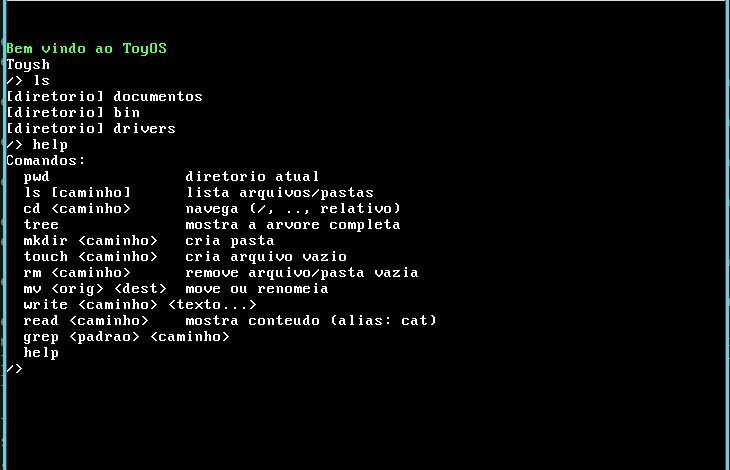

# ToyOS 🍕

Um sistema operacional **de verdade** (mas pequeno, feito a mão) escrito do zero
em C e Assembly x86, trilhando capítulo por capítulo o livro
[_The little book about OS development_](https://littleosbook.github.io/)
("littleosbook", de Erik Helin e Adam Renberg).

O objetivo aqui não é competir com o Linux, é **aprender**. A gente compila um
kernel, faz o computador (via QEMU) bootar ele com o GRUB, escreve na tela, lê o
teclado, cria um sistema de arquivos em memória e até roda um programa em modo
usuário (Ring 3). Tudo isso ao estilo "cada capítulo do livro ficou com uma
pessoa da equipe".

## Como o sistema funciona (em poucas palavras)

1. O GRUB lê o nosso `kernel.elf` junto com dois módulos anexados:
   - `initrd.tar` — um "disco" em memória com arquivos texto (`teste.txt` e `teste2.txt`);
   - `program` — o programa de usuário que roda em Ring 3.
2. O `loader.s` monta as tabelas de página e coloca o kernel rodando na metade
   superior da memória (endereços `0xC0000000+`), onde o kernel "enxerga" toda a RAM.
3. O `kmain` inicializa as peças: porta serial, vídeo (framebuffer), PIC, IDT,
   alocador de memória (PMM) e o sistema de arquivos.
4. O kernel lê o `initrd.tar` (TARFS), cria uma árvore de diretórios em memória
   (RAMFS) e imprime tudo no log serial.
5. Por fim, ele **salta para o modo usuário** (Ring 3). O programa de usuário
   (um shell chamado **Toysh**) passa a conversar com o kernel somente através de
   *system calls* (`int $0x80`).

## Interface



> A tela acima é o que aparece no QEMU quando rodamos `make run`. Enquanto isso,
> o arquivo `serial.log` guarda tudo que o kernel escreveu na porta serial
> (mensagens de inicialização e a árvore do RAMFS).

## Capítulos do livro e quem fez o quê

Cada capítulo do livro foi implementado por alguém da equipe. Preencha a coluna
**Responsável** com os nomes:

| Capítulo | Tema | O que foi parar no projeto | Responsável |
|---|---|---|---|
| 1 | Introdução | Setup do ambiente, ferramentas e ideia geral | _preencher_ |
| 2 | First Steps | Boot com GRUB, cabeçalho multiboot e ISO (`loader.s`, `menu.lst`) | _preencher_ |
| 3 | Getting to C | Pilha e chamada de C a partir do assembly (`loader.s` → `kmain`) | _preencher_ |
| 4 | Output | Framebuffer (VGA) e porta serial (`fb.c`, `serial.c`, `io.s`) | _preencher_ |
| 5 | Segmentation | GDT — Descritores e carregamento (`gdt.c`, `gdt_s.s`) | _preencher_ |
| 6 | Interrupts and Input | IDT, PIC e leitura do teclado (`idt.c`, `interrupts.s`, `pic.c`) | _preencher_ |
| 7 | The Road to User Mode | Módulos do GRUB e como carregar um programa externo | _preencher_ |
| 8 | Virtual Memory (introdução) | Motivação para memória virtual | _preencher_ |
| 9 | Paging | Kernel na metade superior (`loader.s`, `link.ld`) | _preencher_ |
| 10 | Page Frame Allocation | Alocador de memória por frames (`pmm.c`) | _preencher_ |
| 11 | User Mode | TSS, page directory do usuário, salto para Ring 3 (`usermode.c/h`, `enter_usermode.s`, `user/`) | _preencher_ |
| 12 | File Systems | VFS + TARFS (somente leitura) + RAMFS (`vfs.c`, `tarfs.c`, `ramfs.c`) | _preencher_ |
| 13 | System Calls | Gateway `int $0x80` e dispatcher (`syscall.c`, `syscall_s.s`, `syscall.h`) | _preencher_ |
| 14 | Multitasking | Não implementado (fica como desafio futuro 😉) | _preencher_ |

## Dependências

Você precisa de um GCC capaz de compilar código **32 bits** (`-m32`), o
montador **NASM**, o **binutils** (para o `ld`), o **genisoimage** (constrói a
ISO) e o **QEMU** (roda o sistema numa máquina virtual).

### Debian / Ubuntu

```bash
sudo apt update
sudo apt install -y build-essential gcc-multilib nasm genisoimage qemu-system-x86
```

> O pacote `qemu-system-x86` fornece o comando `qemu-system-i386`. Se em alguma
> distro o `-m32` reclamar de cabeçalhos faltando, garanta o `gcc-multilib`.

### Fedora

```bash
sudo dnf install -y @development-tools nasm genisoimage qemu-system-x86
```

### Arch

```bash
sudo pacman -S --needed base-devel nasm genisoimage qemu-system-x86
```

## Compilando

Basta rodar um `make` na raiz (onde está o `Makefile`):

```bash
make
```

Isso gera:

| Artefato | O que é |
|---|---|
| `obj/` | Objetos `.o` do kernel, drivers e programa de usuário |
| `kernel.elf` | O kernel em ELF (com símbolos de debug) |
| `iso/modules/program` | Binário do programa de usuário (Ring 3) |
| `iso/modules/initrd.tar` | O "disco" TARFS com os arquivos de teste |
| `os.iso` | **A ISO final, pronta para bootar!** |

### Limpando a compilação

```bash
make clean
```

Remove tudo que é gerado (`obj/`, `kernel.elf`, `os.iso`, `iso/modules` e o log
serial) e deixa o repositório limpo para recompilar do zero.

## Rodando

```bash
make run
```

Isso recompila se preciso, abre o **QEMU** com a `os.iso` e:

- mostra o vídeo do sistema na janela do QEMU (é com ele que você interage,
  digitando no shell);
- grava o log serial no arquivo `serial.log` (as mensagens de boot do kernel,
  a árvore do RAMFS etc.);
- abre o **monitor do QEMU** no terminal (dá pra digitar `quit` para sair).

Para sair do QEMU: feche a janela ou digite `quit` no monitor.

## Onde fica a ISO resultante

Na raiz do projeto:

```
ToyOS/os.iso
```

Ela é uma ISO bootável (formato El Torito) gerada pelo `genisoimage` a partir
da pasta `iso/`. Você pode bootá-la no QEMU (`make run`), em outra VM, ou até
escrevê-la num pendrive/CD e tentar em hardware real (com os devidos riscos 😄).

## Usando o shell (Toysh)

Depois do boot, o sistema cai num prompt do tipo `/>`. Os comandos são:

```text
pwd                 mostra o diretório atual
ls [caminho]        lista arquivos/pastas
cd <caminho>        navega (suporta / , . e ..)
tree                mostra a árvore completa dos arquivos
mkdir <caminho>     cria uma pasta
touch <caminho>     cria um arquivo vazio
rm <caminho>        remove arquivo ou pasta vazia
mv <orig> <dest>    move ou renomeia
write <caminho> <texto...>
                    grava texto num arquivo
read <caminho>      mostra o conteúdo do arquivo (alias: cat)
grep <padrao> <caminho>
                    procura um texto dentro do arquivo
help                lista os comandos
```

Exemplo rápido de sessão:

```text
/> ls
[diretorio] documentos
[diretorio] bin
[diretorio] drivers
/> cd documentos
/documentos> pwd
/documentos
/documentos> touch anotacoes.txt
touch: criado
/documentos> write anotacoes.txt viva o ToyOS
write: gravado 13 bytes
/documentos> read anotacoes.txt
viva o ToyOS
```

## Estrutura do projeto

```text
ToyOS
├── Makefile            → alvo da compilação (all, run, clean)
├── link.ld             → script de link do kernel (metade superior)
├── interface.png       → screenshot da interface
├── loader.s            → entrada do kernel: multiboot + paging
├── kernel/             → miolo do sistema operacional
│   ├── kmain.c         → função principal de inicialização
│   ├── gdt.c/h .s      → global descriptor table
│   ├── idt.c .s        → interrupções e teclado
│   ├── pmm.c           → alocador de memória física (frames)
│   ├── usermode.c/h    → prepara o modo usuário (Ring 3)
│   ├── enter_usermode.s→ salto final para o programa de usuário
│   ├── syscall.c/.s    → system calls (int $0x80)
│   ├── vfs.c / tarfs.c / ramfs.c → sistema de arquivos
│   └── string.c        → funções úteis (strcmp, memcpy...)
├── drivers/            → acesso ao hardware (fb, serial, io, pic)
├── user/               → programa de usuário (Ring 3), incluindo o shell Toysh
├── include/            → cabeçalhos (.h) compartilhados
└── iso/                → conteúdo da ISO (GRUB, kernel e módulos)
```

## Dicas e erros comuns

- **`make run` não abre o QEMU** → confira se o `qemu-system-i386` está
  instalado (`which qemu-system-i386`).
- **Quebrou o código e o Windows/VM não mostra nada além de um cursor** → o
  kernel travou cedo. Confira o `serial.log`: as mensagens de boot estão lá e
  mostram até onde ele foi (ou usou `make clean && make` para recompilar limpo).
- **`command not found: genisoimage`** → instale o pacote correspondente
  (genisoimage no Debian/Ubuntu).
- A ISO final (`os.iso`) é o artefato que importa; pode ser movida/regravada à
  vontade, mas `make` a reconstrói sozinha se faltar.

Bom hackeio! 🚀